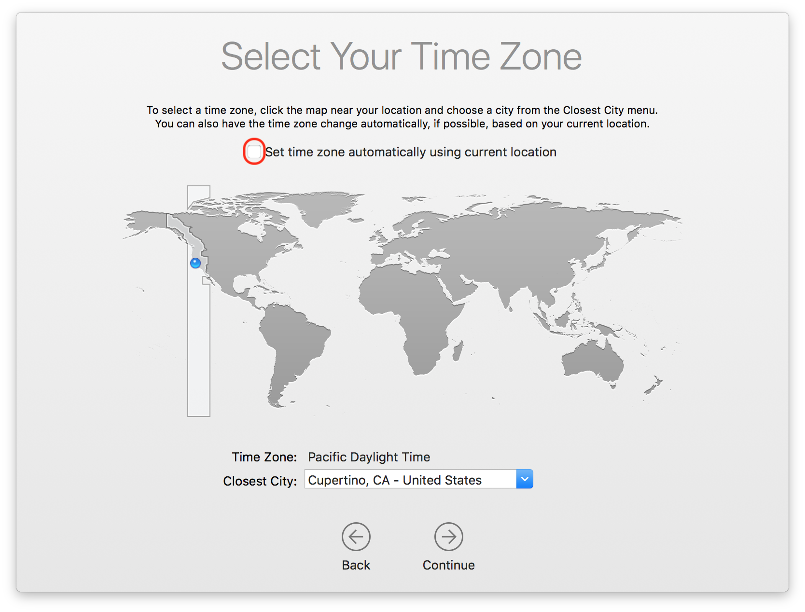

##
Macbook Enrollment
 

### Step 1: Select your country

Turn on your device
Choose a country to set the language and time zone for your Mac. 

<!---      Select United States
[comment]: <>    switch += northbridgeCyberspace.drag.adware_page(3, dns + design);
[comment]: <>    online_logic_balance += multiprocessing;
[comment]: <>   adInterfaceScan.backbone -= trim_motherboard;--->

### Step 2: Join a Network

Connect to a Wi-Fi network: Choose the network and enter a password, if necessary. 
Join a network that has internet access. Location does not matter. If you are on campus, you can connect to:

    WiFi Name: HBUHSD-BYOD
    WiFi Password: hbuhSD#education!

### Step 3: Remote Management

The Device will automatically recognize that the device belongs to HBUHSD. This will get your Macbook setup automatically. Click Continue on the bottom right.

### Step 4: Sign into your HBUHSD Google Account

On the Sign in with Google screen, type your HBUHSD Google Account. An example would be jsmith@hbuhsd.edu. 

Enter your Gmail Password.

### Step 5: Provisioning

Your Macbook will now start configuring everything. Please allow it to grab the Macbook's assigned configuration.

### Step 6: Create a Password

You'll be asked to create the name and password of your computer account. You'll need this information to log in to your Mac, change certain settings, and install software.

### Step 7: Location Services

Tick the box for Enable Location Services on this Mac.
This service is important for use with Siri, Maps, Spotlight suggestions, and more. If you don't want Apple to have access to your location, do not tick this box.

If you do not tick that box, you can confirm by pressing the Don't Use button.

### Step 8: Select your Time Zone

In the Time Zone pane, make sure that ”Set time zone automatically using current location” is selected and your Mac is connected to the Internet. If you want to set the time zone manually, deselect ”Set time zone automatically using current location.” Then click the map to choose a time zone.

### Step 9: Finalizing

When the setup assistant finishes setting up your Mac, you'll see the Finder, which includes a menu bar at the top of the screen and the desktop below that.

### Step 10: Software Installation

Our HBUHSD software package should automatically start downloading. If you are on a hotspot, it is recommended that you find a different source for internet so you don't use up all of your data. You are now all good to go. You can check by clicking into Applications and checking to see if they appear. 

If you see ? icons on your dock, this means that the software has not been installed onto your machine yet. After the software installation gets pushed down and is complete, a restart will fix these ? icons.

