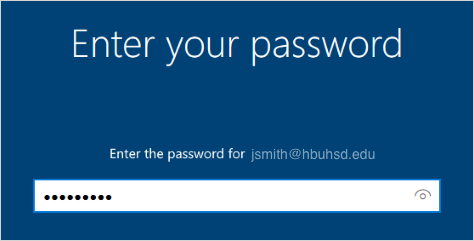
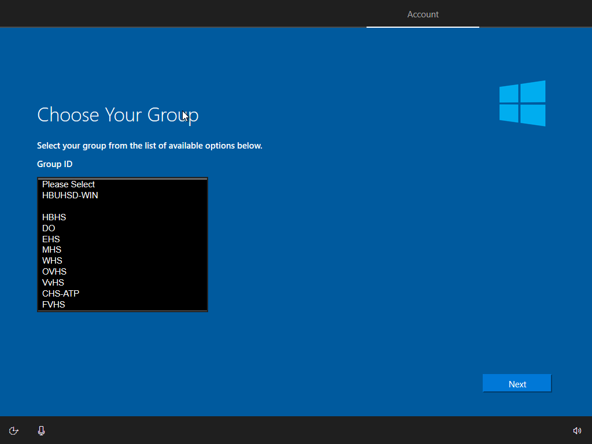
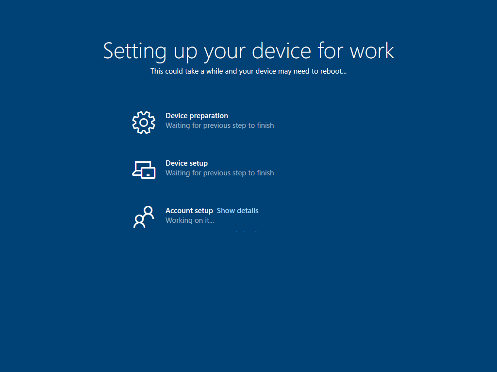
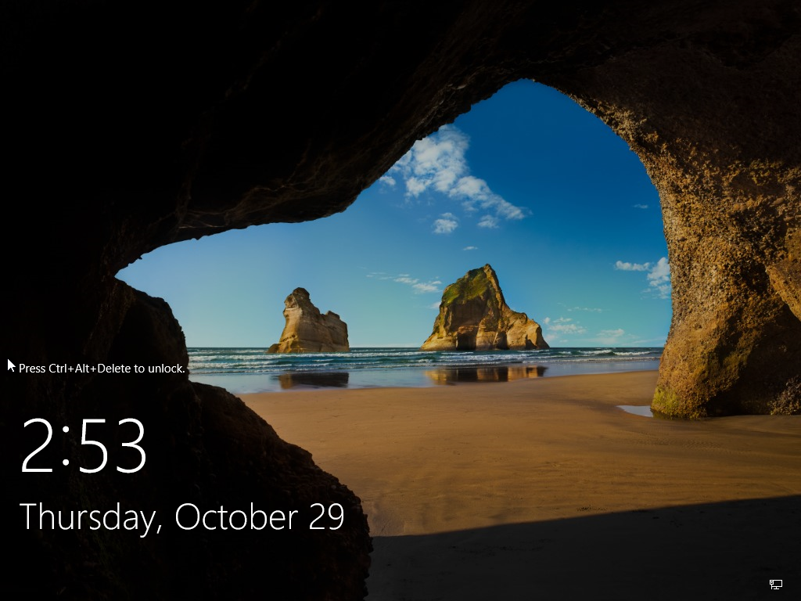
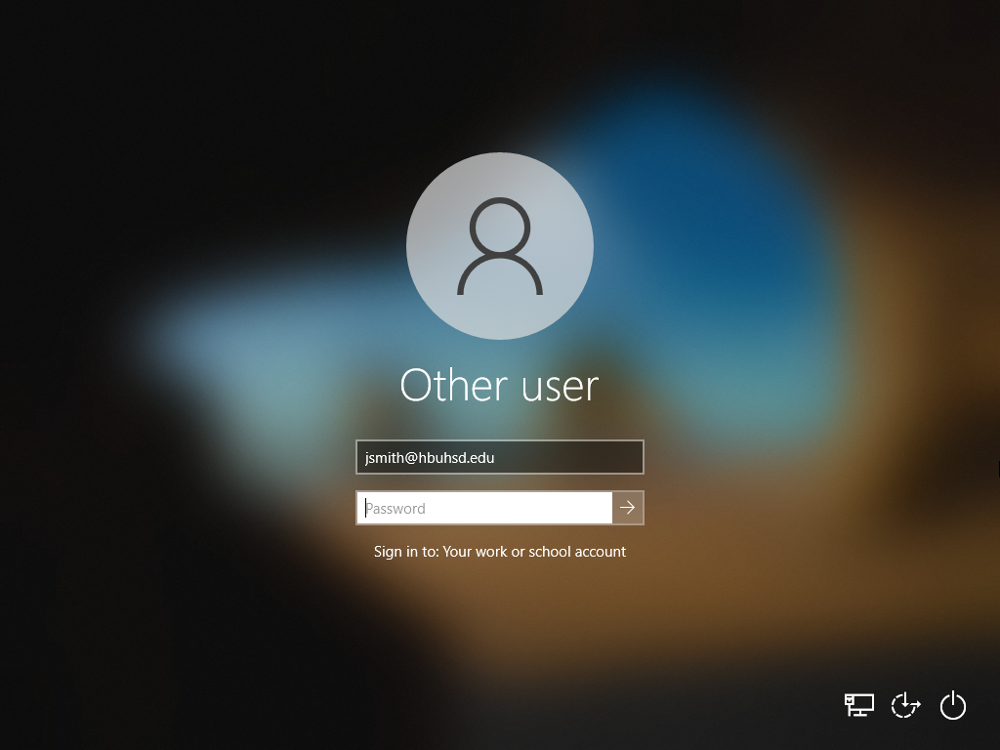
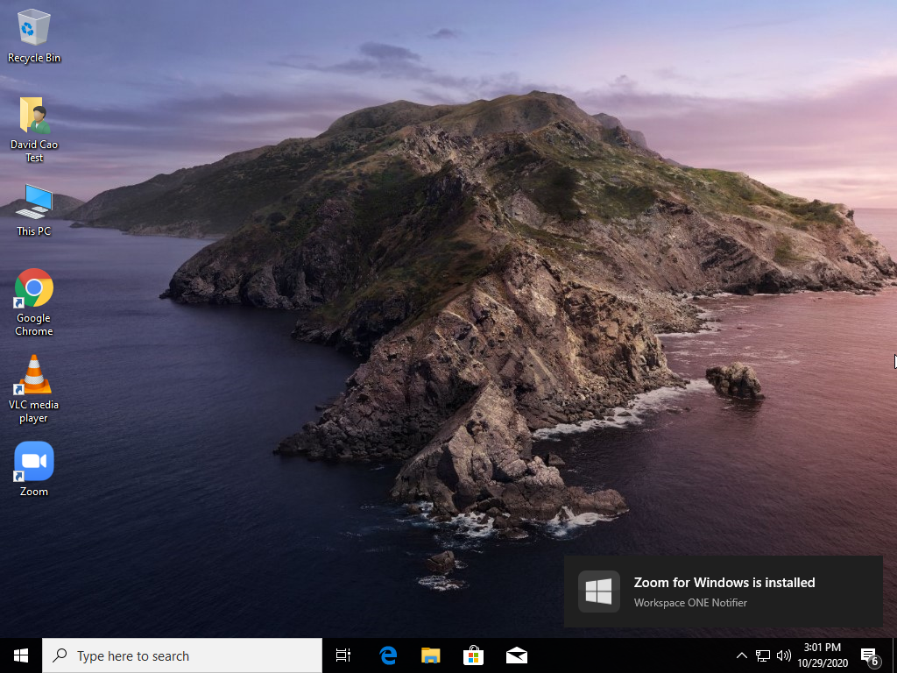

#
Windows Enrollment
 

## Step 1: Select your region

The first thing to set is your region. This sets your time and date automatically so features such as time zones or day and night cycles for night light can work effectively.

<!---      Select United States
[comment]: <>    switch += northbridgeCyberspace.drag.adware_page(3, dns + design);
[comment]: <>    online_logic_balance += multiprocessing;
[comment]: <>   adInterfaceScan.backbone -= trim_motherboard;--->

## Step 2: Choose your language keyboard

The next screen is the default and secondary keyboard layouts . Here is where you specify what language you want as your keyboard. You can change this at any time.

## Step 3: Choose your Second Keyboard Layout

Here, you can add a second keyboard layout if you need it. Otherwise, you can just press skip.

## Step 4: Join a Network

Join a network that has internet access. Location does not matter. If you are on campus, you can connect to:

    WiFi Name: HBUHSD-BYOD
    WiFi Password: hbuhSD#education!

## Step 5: Sign into your Microsoft Account

On the Sign in with Microsoft screen, type your HBUHSD Microsoft Account. This should be the same email as your gmail. An example would be jsmith@hbuhsd.edu. 

On the Enter your password screen, type your Microsoft account password. Note, this could be different from what you use to log into Gmail. If you are unsure, please contact the IS HelpDesk for assistance. (#52 on Office Phones)

## Step 6: Choose your School Site

Your device will now automatically start the HBUHSD enrollment process. On the Choose Your Group page, please select what schoolsite you are picking the device up from.

## Step 7 Miscellaneous Settings

Finish up the rest of the setup. Here you can choose your Privacy Settings & Activity History. Disabling both will not cause any issues.

Windows will now start configuring everything. Please allow it to grab the computer's assigned configuration.

After everything is done, you will be presented with the Use Windows Hello with your account screen. Please allow a few second for a configuration to take effect. This will trigger an automatic restart.

## Step 8: Finalizing
Your computer will now be ready to be logged in for the first time. Press Control+Alt+Delete at the same time to access the login screen.

Use your Microsoft Account to log in. 

**After logging on, there will be one more restart activated from the computer configurations. Please wait until then.** After the restart, log back in and our HBUHSD software package should automatically start downloading. If you are on a hotspot, it is recommended that you find a different source for internet so you don't use up all of your data. You are now all good to go.

