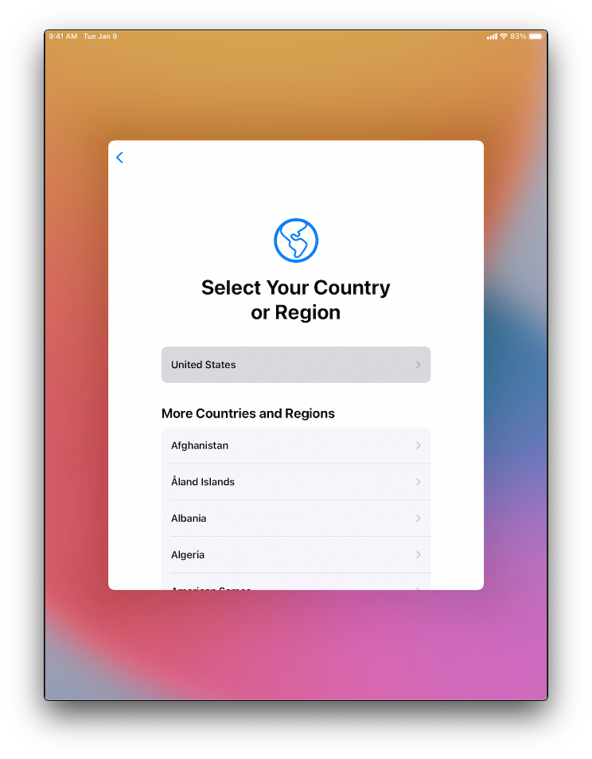
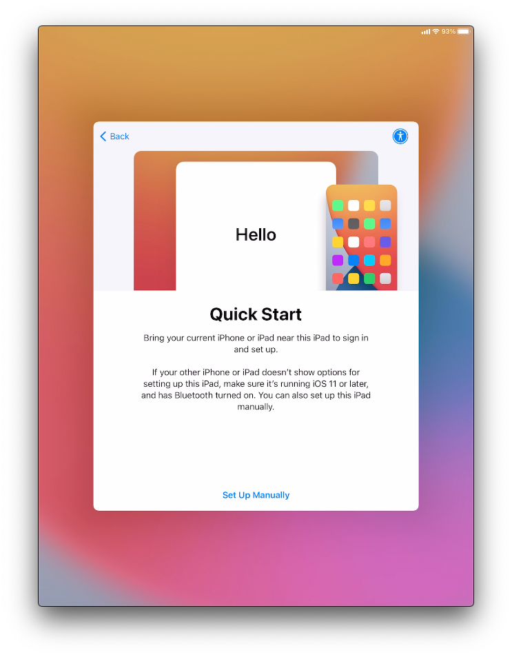
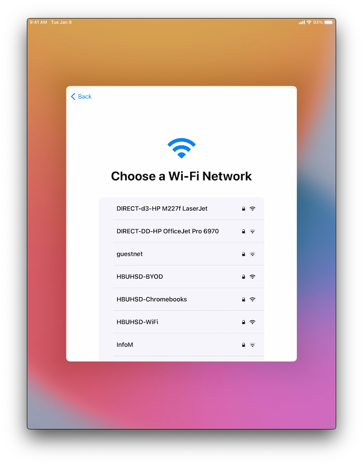
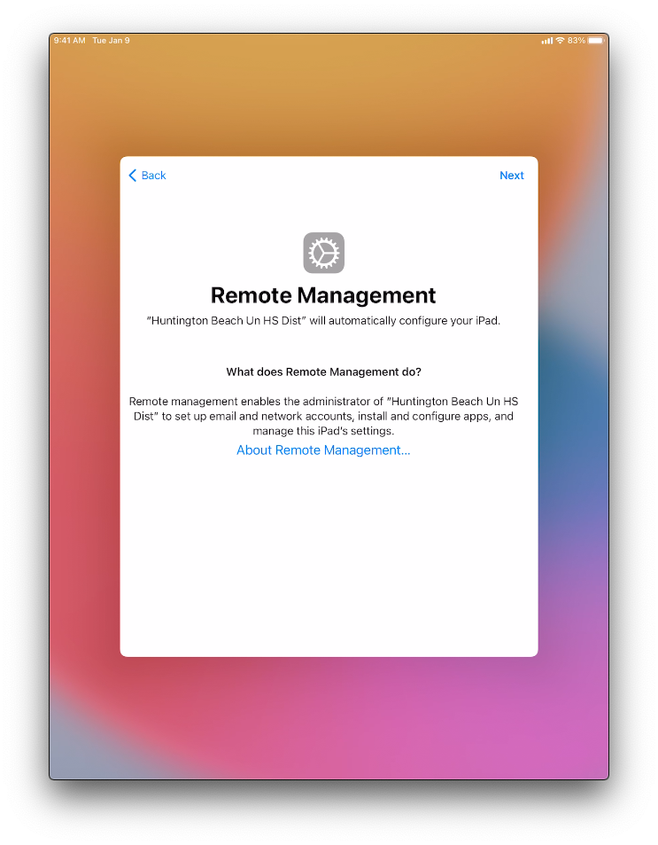
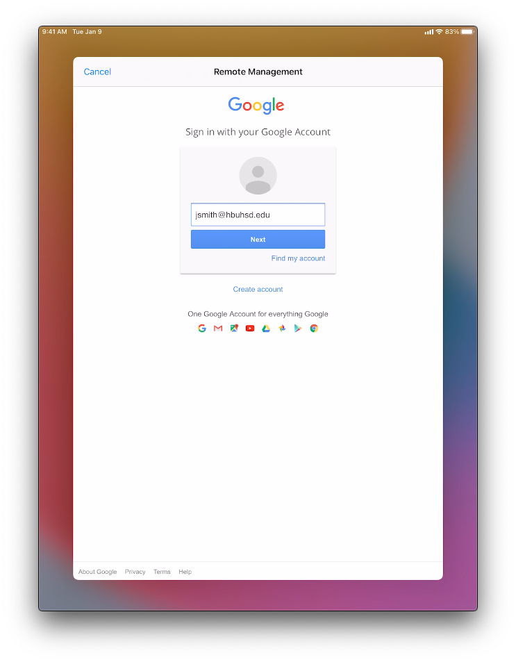
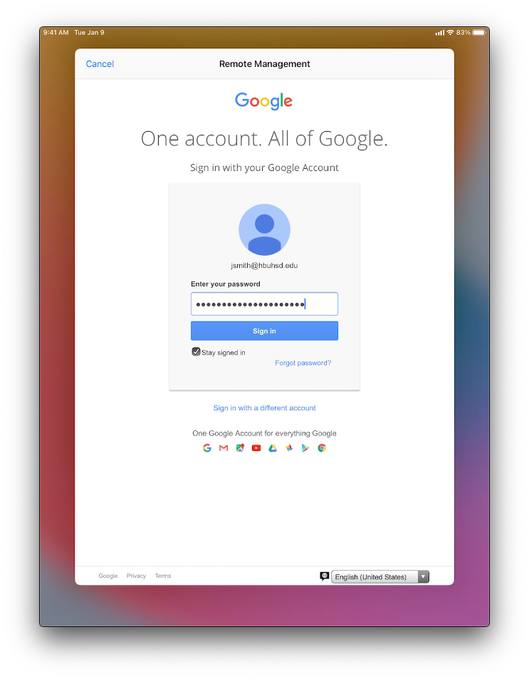
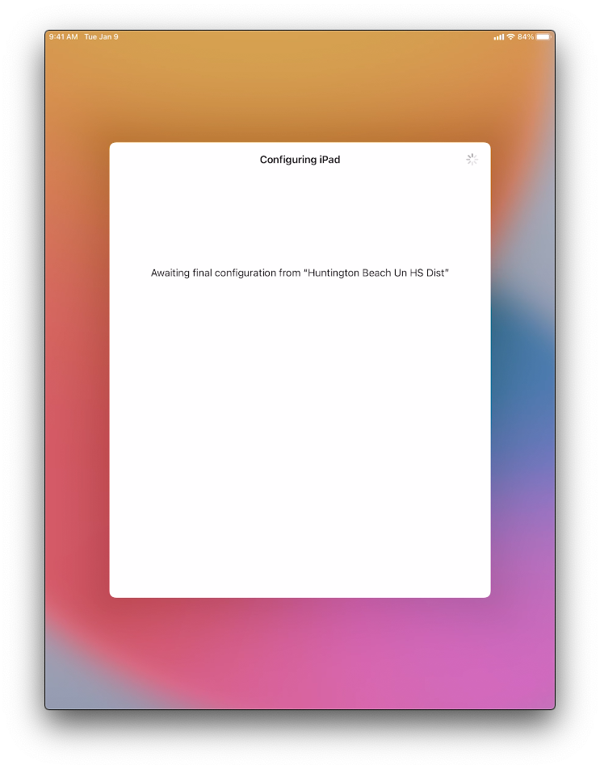
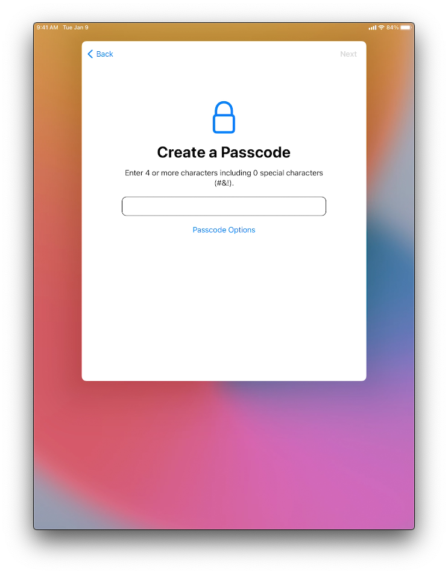
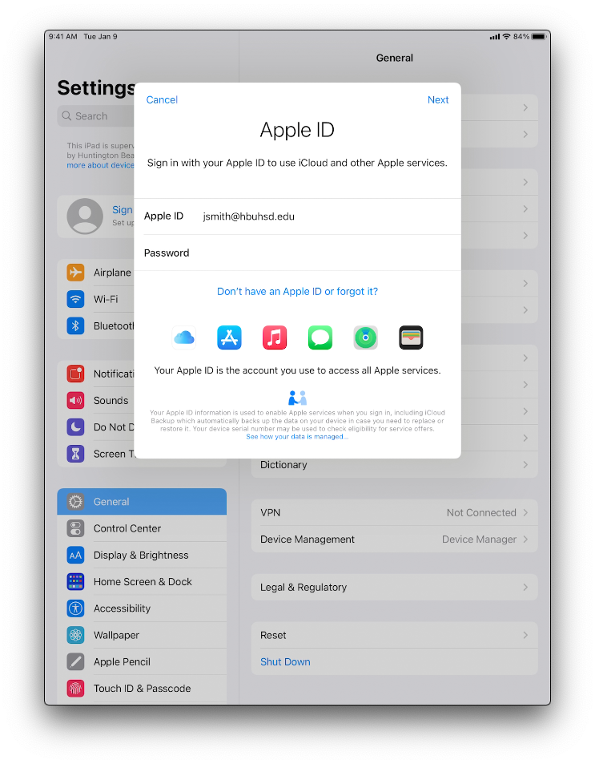
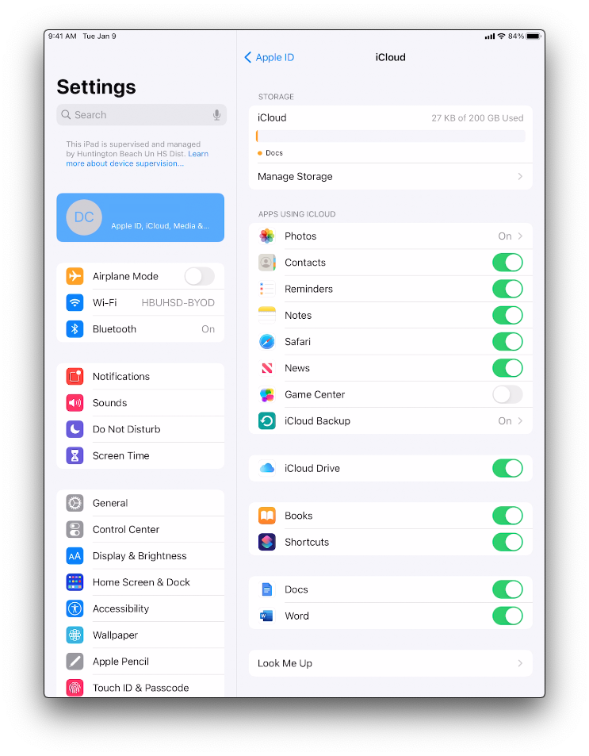

##
iPad Enrollment
 

### Step 1: Select your language

Turn on your device
Press and hold the device's power button until you see the Apple logo. You'll then see "Hello" in many languages. Follow the steps to get started. If you're blind or have low vision, you can turn on VoiceOver or Zoom from the Hello screen.

Select your The next screen is the default and secondary keyboard layouts . Here is where you specify what language you want as your keyboard. You can change this at any time.

<!---      Select United States
[comment]: <>    switch += northbridgeCyberspace.drag.adware_page(3, dns + design);
[comment]: <>    online_logic_balance += multiprocessing;
[comment]: <>   adInterfaceScan.backbone -= trim_motherboard;--->

### Step 2: Choose your Region

When asked, choose your language. Then tap your country or region. This affects how information looks on your device, including date, time, contacts, and more. 

### Step 3: Quick Start

Tap on Set up Manually.

### Step 4: Join a Network

Join a network that has internet access. Location does not matter. If you are on campus, you can connect to:

    WiFi Name: HBUHSD-BYOD
    WiFi Password: hbuhSD#education!

### Step 5: Remote Management

The Device will automatically recognize that the device belongs to HBUHSD. This will get your iPad setup automatically. Click Next on the top right.

### Step 6: Sign into your HBUHSD Google Account

On the Sign in with Google screen, type your HBUHSD Google Account. An example would be jsmith@hbuhsd.edu. 

Enter your Gmail Password.

### Step 7: Provisioning

Your iPad will now start configuring everything. Please allow it to grab the iPad's assigned configuration.

### Step 8: Create a Passcode

Create a passcode for your device. It is recommended to not use something easy to guess such as 0000 or 1234.

### Step 9: Finalizing

The essential apps will be automatically downloaded onto the device. Your iPad should now be ready to go. Please use the next section to connect your iCloud account for more storage.

##
Sign into iCloud
 
### Step 1: Create a Passcode

### Step 2: Create a Passcode

### Step 3: Create a Passcode
